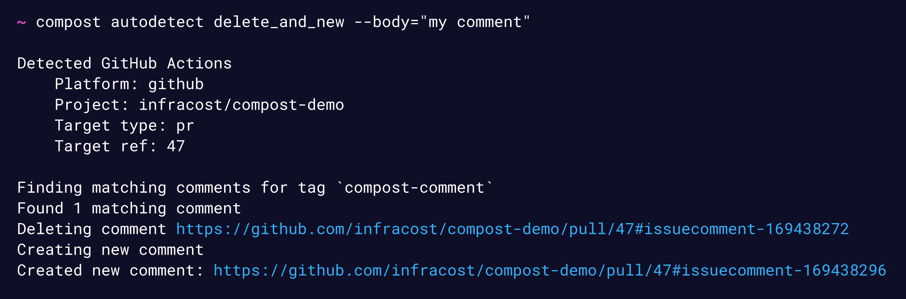

# Compost

Compost is for tools that run in CI pipelines and want to post results as pull request/commit comments.



It currently detects the following CI environments:
* GitHub Actions
* GitLab CI
* Azure DevOps
* Azure DevOps (GitHub)

Coming soon:
* BitBucket
* Circle CI (GitHub)
* CircleCI (BitBucket)

## Install

```sh
npm install -g @infracost/compost
```

## Examples

Detect the current CI environment and update the previously posted comment. If a previous comment hasn't been posted, then this creates a new comment:

```sh
compost autodetect update --body="my comment"
```

Post a new comment:

```sh
compost autodetect new --body="my new comment"
```

Delete the previous posted comments and post a new comment:

```sh
compost autodetect delete-and-new --body="my new comment"
```

Hide the previous posted comments and post a new comment (**Note:** Currently only supported for GitHub):

```sh
compost autodetect hide-and-new --body="my new comment"
```

Get the latest comment that was posted by compost

```sh
compost autodetect latest
```

Post a comment to a specific GitHub pull request:

```sh
compost github update infracost/compost-example pr 3 --body="my PR comment"
```

Post a comment to a specific GitHub commit SHA:

```sh
compost github update infracost/compost-example commit 2ca7182 --body="my commit comment"
```

## Flags

| Name&nbsp;&nbsp;&nbsp;&nbsp;&nbsp;&nbsp;&nbsp;&nbsp;&nbsp;&nbsp;&nbsp;&nbsp;&nbsp;&nbsp;&nbsp;&nbsp;&nbsp;&nbsp;&nbsp;&nbsp;&nbsp;&nbsp; | Description |
|-|-|
| `--body` | Specify the comment body content. |
| `--body-file` | Specify a path to a file containing the comment body. Mutually exclusive with `--body`. |
| `--tag` | Customize the comment tag. This is added to the comment as a markdown comment to detect the previously posted comments. |
| `--platform` | Options: `github`, `gitlab`, `azure-devops`. Only supported by `autodetect` command. Limit the auto-detection to the specified platform. |
| `--target-type` | Options: `pull-request` (`pr`), `merge-request` (`mr`), `commit`. Only supported by `autodetect` command. Limit the auto-detection to add the comment to either pull/merge requests or commits. |
| `--dry-run` | Skips any comment posting, deleting or hiding. |
